# Restaurant Marketplace

A restaurant marketplace application with a mobile frontend (React Native/Expo) and a backend API (Node.js/Express) that provides restaurant listings sorted by distance from the user's location.

## Screenshots

<div align="center">
  
  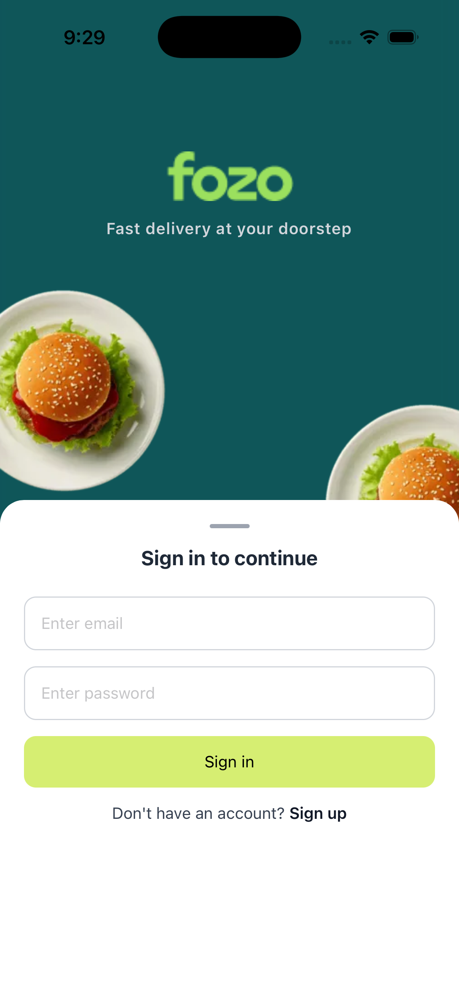
  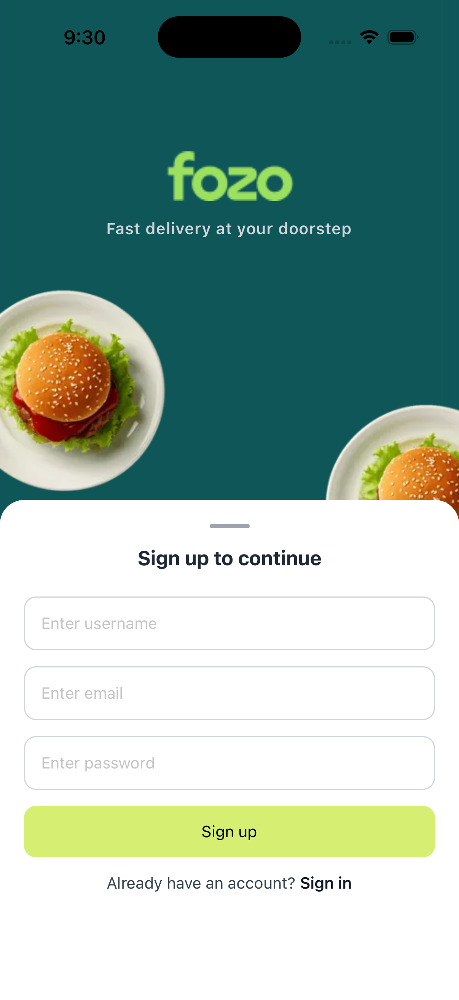
  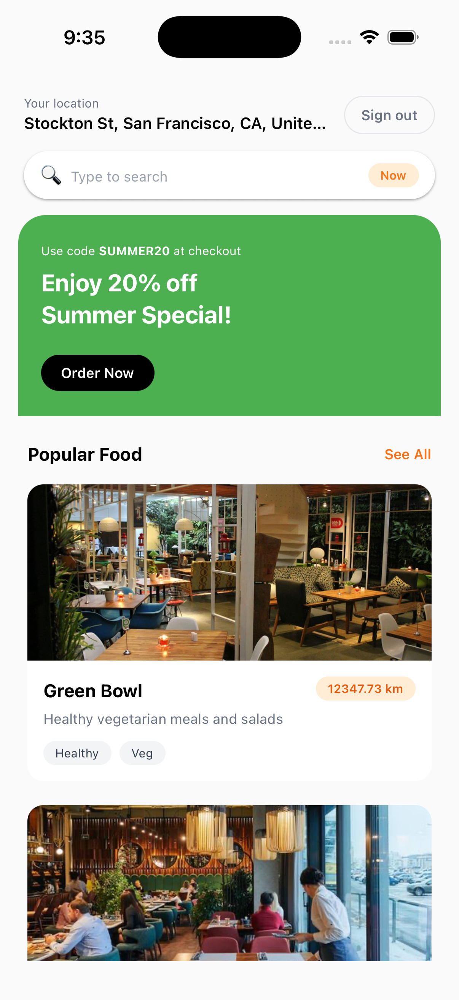
  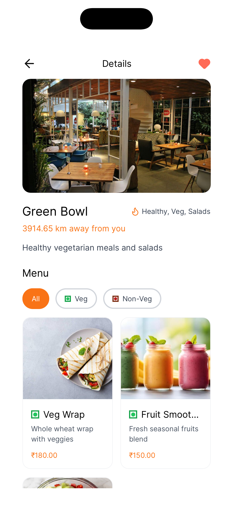
  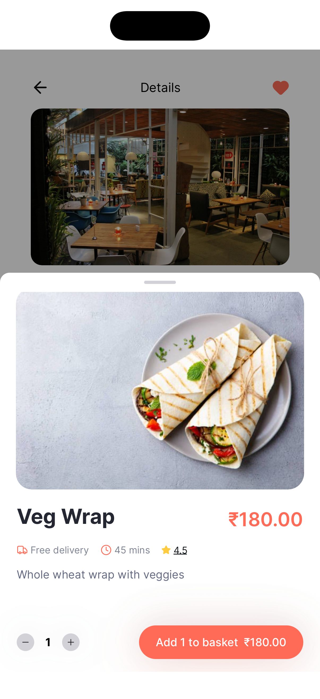
  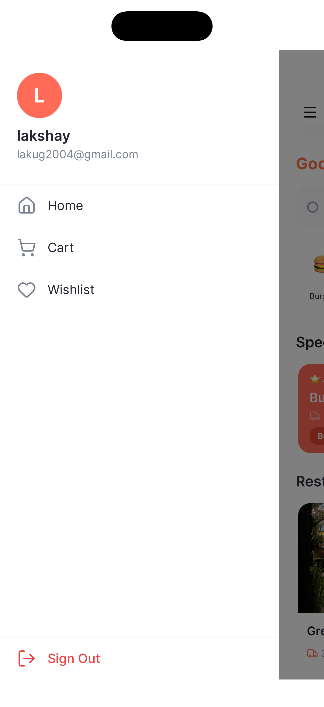
  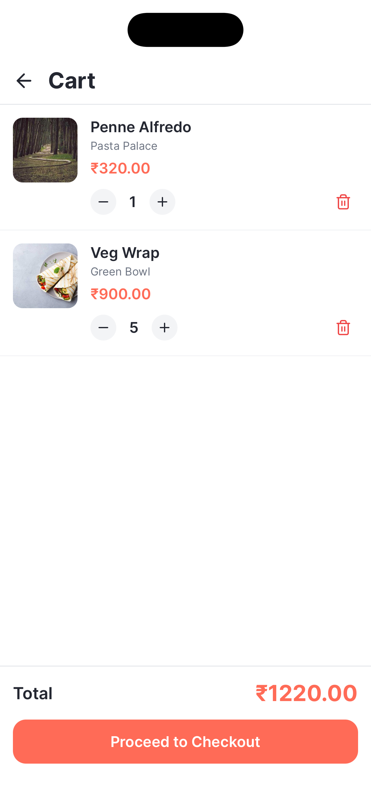
  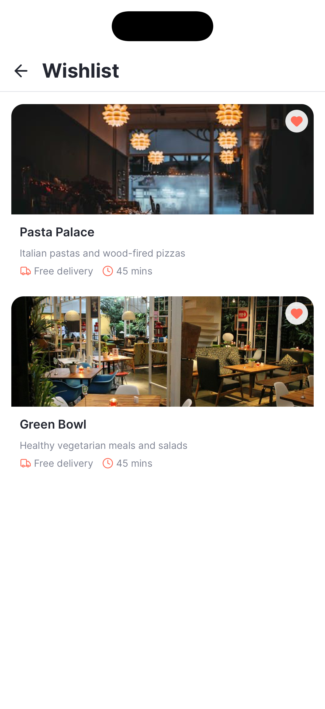
  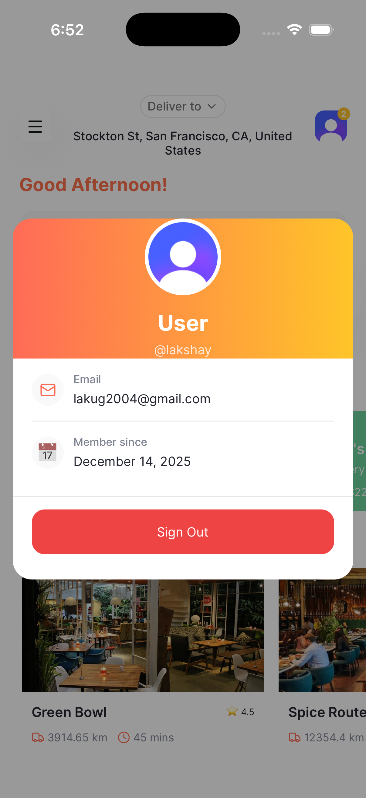
  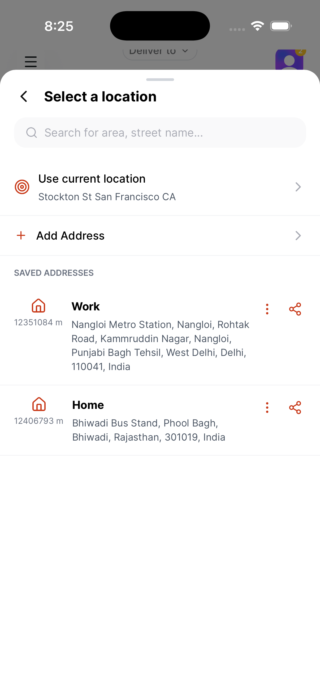
  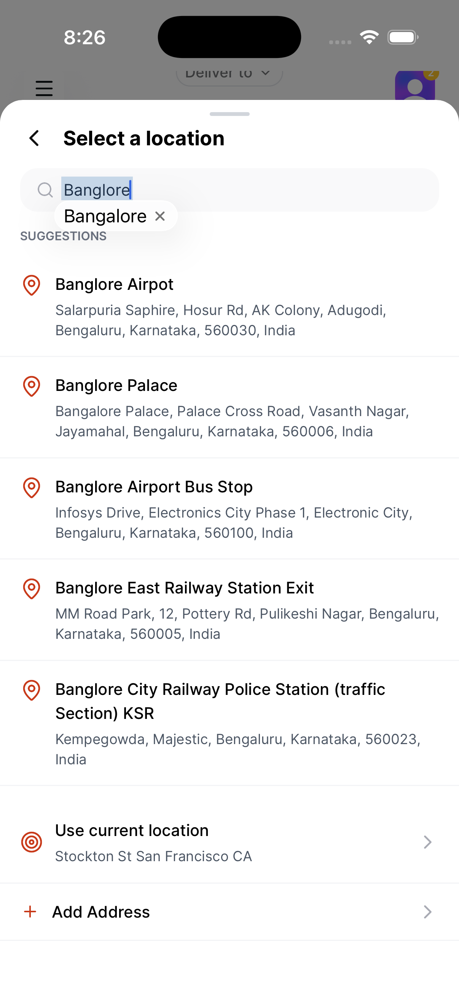
  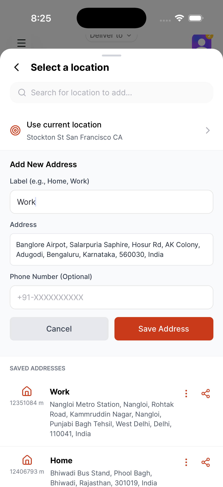
</div>

## Features

- Restaurant listing with distance-based sorting
- Multiple location selection (save and switch between multiple addresses)
- Real-time distance calculation using Haversine formula
- Location autocomplete with debouncing and caching
- Restaurant detail pages with menu items
- User authentication and location tracking
- Backend-sorted restaurant results

## Prerequisites

- Node.js and npm installed
- Docker installed (for PostgreSQL database)
- Expo CLI installed (for mobile app development)
- Bun runtime (for backend)
- ngrok (optional, for mobile device testing - see "Connecting Mobile App to Backend" section)

## Backend Setup

### 1. Start PostgreSQL Database

Run the following command to start a PostgreSQL container:

```bash
docker run -d --name prisma-postgres \
  -e POSTGRES_USER=user \
  -e POSTGRES_PASSWORD=password \
  -e POSTGRES_DB=mydb \
  -p 5432:5432 \
  postgres:15
```

### 2. Configure Environment Variables

Navigate to the backend directory and copy the environment example file:

```bash
cd backend
cp .env.example .env
```

Edit the `.env` file with your database connection details if needed.

### 3. Install Dependencies

```bash
npm install
```

### 4. Run Database Migrations

```bash
npx prisma migrate dev
```

### 5. Generate Prisma Client

```bash
npx prisma generate
```

### 6. Seed the Database

Populate the database with sample restaurant and user data:

```bash
npm run seed
```

### 7. Start the Backend Server

```bash
npm run dev
```

The backend server will run on `http://localhost:3000` by default.

### 8. Optional: Open Prisma Studio

To view and manage database records through a GUI:

```bash
npx prisma studio
```

## Connecting Mobile App to Backend

When running the React Native app on a physical device, you need to configure it to connect to your backend server. There are two methods:

#### Step 1: Install ngrok

```bash
npm install -g ngrok
```

#### Step 2: Sign up and Get Authtoken

1. Sign up for a free account at [https://dashboard.ngrok.com/signup](https://dashboard.ngrok.com/signup)
2. Get your authtoken from [https://dashboard.ngrok.com/get-started/your-authtoken](https://dashboard.ngrok.com/get-started/your-authtoken)

#### Step 3: Configure ngrok Authtoken

```bash
ngrok config add-authtoken <your-authtoken>
```

Replace `<your-authtoken>` with the token you received from the ngrok dashboard.

#### Step 4: Start ngrok Tunnel

Make sure your backend server is running on port 3000, then start ngrok:

```bash
ngrok http 3000
```

This will display a forwarding URL like `https://xxxx-xx-xx-xx-xx.ngrok-free.app`. Copy this URL.

#### Step 5: Configure Frontend Environment

Create a `.env` file in the `frontend` directory:

```bash
cd frontend
echo "EXPO_PUBLIC_BACKEND_URL=https://xxxx-xx-xx-xx-xx.ngrok-free.app" > .env
```

Replace `https://xxxx-xx-xx-xx-xx.ngrok-free.app` with your actual ngrok URL.

**Note:** The ngrok URL changes each time you restart ngrok (unless you have a paid plan with a static domain). You'll need to update the `.env` file if you restart ngrok.

## Frontend Setup

### 1. Navigate to Frontend Directory

```bash
cd frontend
```

### 2. Install Dependencies

```bash
npm install
```

### 3. Configure Backend URL

Before running the app on a physical device, make sure you've configured the backend URL. See the [Connecting Mobile App to Backend](#connecting-mobile-app-to-backend) section above for detailed instructions.

For emulator/simulator testing, you can use:
```bash
echo "EXPO_PUBLIC_BACKEND_URL=http://localhost:3000" > .env
```

### 4. Run the Mobile App

For Android:

```bash
npm run android
```

For iOS:

```bash
npm run ios
```

## Backend Architecture

### API Endpoints

The backend provides the following REST endpoints:

- `POST /users` - Create a new user account
- `POST /restaurants` - Fetch all restaurants sorted by distance (accepts optional latitude/longitude for selected address)
- `POST /restaurants/:restaurantId` - Fetch a specific restaurant by ID (accepts optional latitude/longitude for selected address)
- `GET /location/autocomplete?input={query}` - Get location suggestions with debouncing and caching
- `GET /location/reverse-geocode?lat={lat}&lng={lng}` - Reverse geocode coordinates to address
- `POST /addresses` - Create a new saved address
- `POST /addresses/list` - Get all saved addresses for a user (with optional distance calculation from current location)
- `PUT /addresses/:addressId` - Update a saved address
- `DELETE /addresses/:addressId` - Delete a saved address

## Multiple Location Selection Architecture

The application supports multiple saved addresses and allows users to select different locations for restaurant distance calculations. This feature enables users to view restaurants sorted by distance from any saved address or their current location.

### Location Selection Flow

1. **Address Context Management**: The application uses React Context (`AddressContext`) to manage the currently selected address across the entire application. The context provides:
   - `selectedAddress`: The currently selected address object (or null if using default location)
   - `setSelectedAddress`: Function to update the selected address

2. **Address Storage**: Users can save multiple addresses in the database, each with:
   - Label (e.g., "Home", "Work")
   - Full address string
   - Latitude and longitude coordinates
   - Optional phone number
   - Default address flag

3. **Location Selection Options**: Users can select a location through the `LocationSelectorModal` component, which provides three options:
   - **Saved Addresses**: Select from previously saved addresses
   - **Current Location**: Use device GPS location (temporary, not saved)
   - **Search and Add**: Search for new locations and save them as addresses

### Restaurant Distance Calculation for Selected Location

When a user selects a location (saved address or current location), the restaurant listing is recalculated based on that location:

1. **Location Selection**: When a user selects an address from the location selector modal, the `setSelectedAddress` function updates the global address context with the selected address coordinates.

2. **Restaurant Fetching**: The `useRestaurants` hook monitors the `selectedAddress` from the context. When the selected address changes, it automatically triggers a new restaurant fetch.

3. **Coordinate Passing**: The hook passes the selected address coordinates (latitude and longitude) to the backend API when making the restaurant request:
   - If `selectedAddress` exists: Uses `selectedAddress.latitude` and `selectedAddress.longitude`
   - If `selectedAddress` is null: Uses the user's default location from the database

4. **Backend Processing**: The backend restaurant endpoint (`POST /restaurants`) receives the coordinates:
   - If coordinates are provided: Uses them directly for distance calculation
   - If coordinates are not provided: Fetches the user's default location from the database

5. **Distance Calculation**: For each restaurant, the backend calculates the distance using the Haversine formula between:
   - The selected location coordinates (or default user location)
   - Each restaurant's coordinates

6. **Result Sorting**: All restaurants are sorted by distance in ascending order, with the nearest restaurant first.


### Address Management

Users can manage their saved addresses through the location selector:

1. **Adding Addresses**: 
   - Search for a location using autocomplete
   - Select a location from suggestions
   - Provide a label (e.g., "Home", "Work")
   - Optionally add a phone number
   - Save the address to the database

2. **Viewing Addresses**: 
   - All saved addresses are displayed in the location selector
   - If current location is available, distances from current location to each saved address are calculated and displayed
   - Addresses are sorted by default status first, then by creation date

3. **Selecting Addresses**: 
   - Clicking a saved address immediately selects it and closes the modal
   - The restaurant list automatically refreshes with distances from the selected address

4. **Deleting Addresses**: 
   - Users can delete saved addresses through the location selector
   - Deletion requires confirmation

### Current Location Handling

The application also supports using the device's current GPS location:

1. **Permission Request**: When the user chooses "Use current location", the app requests location permissions.

2. **Location Retrieval**: Uses Expo Location API to get current coordinates.

3. **Reverse Geocoding**: Attempts to get a human-readable address:
   - First tries backend reverse geocode API (OLA Maps)
   - Falls back to Expo Location reverse geocode
   - Uses coordinates as last resort

4. **Temporary Address**: Creates a temporary address object (not saved to database) with:
   - Label: "Current Location"
   - Coordinates from GPS
   - Address string from reverse geocode

5. **Restaurant Calculation**: Uses the current location coordinates to calculate restaurant distances, same as saved addresses.

## Distance Calculation

The application uses the Haversine formula to calculate the great-circle distance between two points on the Earth's surface given their latitude and longitude coordinates.

### Haversine Formula (Mathematical Reference)

Given:
- User location → (lat₁, lon₁)
- Restaurant location → (lat₂, lon₂)

The formula calculates the great-circle distance between two points on Earth.

**Mathematical Formula:**

```
a = sin²(Δφ/2) + cos(φ₁) · cos(φ₂) · sin²(Δλ/2)

c = 2 · atan2(√a, √(1−a))

distance = R · c
```

Where:
- **R** = 6371 km (Earth's radius)
- **φ₁, φ₂** = latitudes in radians
- **λ₁, λ₂** = longitudes in radians
- **Δφ** = difference in latitude (φ₂ - φ₁)
- **Δλ** = difference in longitude (λ₂ - λ₁)

**Note:** Latitudes and longitudes must be converted from degrees to radians before calculation.

### Haversine Formula Implementation

The distance calculation is performed in the `backend/src/utils/distance.ts` file using the following mathematical approach:

1. **Coordinate Conversion**: Latitude and longitude values are converted from degrees to radians.

2. **Haversine Calculation**: The formula computes the distance using:
   - Earth's radius: 6371 kilometers
   - Difference in latitude and longitude between the two points
   - Trigonometric functions (sine and cosine) to account for the Earth's curvature

3. **Formula Steps**:
   - Calculate the squared sine of half the latitude difference
   - Add the product of cosines of both latitudes and the squared sine of half the longitude difference
   - Apply the inverse tangent function to compute the central angle
   - Multiply by Earth's radius to get the distance in kilometers

4. **Result**: The function returns the distance in kilometers, rounded to two decimal places for display purposes.

The Haversine formula provides accurate distance calculations for most practical purposes, with an error margin of less than 0.5% for typical use cases.

## Database Schema

The application uses Prisma ORM with PostgreSQL. Key models include:

- **User**: Stores user information including username, email, and default location coordinates
- **Restaurant**: Stores restaurant details including name, description, tags, image URL, and location coordinates
- **Menu**: Stores menu items associated with restaurants, including item name, price, description, image, and vegetarian status
- **Address**: Stores user's saved addresses with label, full address, coordinates, optional phone number, and default flag

## Technology Stack

### Backend
- Node.js with Express.js
- Bun runtime
- Prisma ORM
- PostgreSQL database
- TypeScript

### Frontend
- React Native
- Expo framework
- TypeScript
- NativeWind (Tailwind CSS for React Native)
